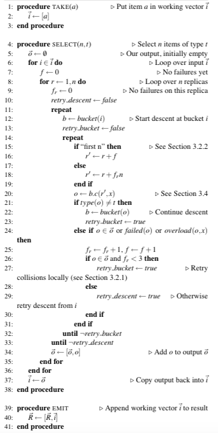
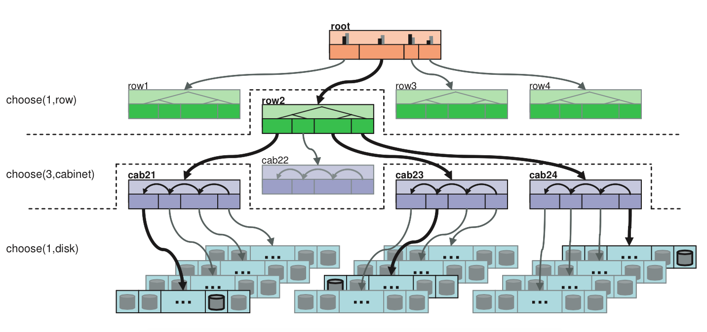

# CRUSH详解

## CRUSH简介

CRUSH全称Controlled Replication Under Scalable Hashing，是一种数据分发算法，类似于哈希和一致性哈希。哈希的问题在于数据增长时不能动态加Bucket，一致性哈希的问题在于加Bucket时数据迁移量比较大，其他数据分发算法依赖中心的Metadata服务器来存储元数据效率较低，CRUSH则是通过计算、接受多维参数的来解决动态数据分发的场景。

## 算法基础

在学习CRUSH之前，需要了解以下的内容。

CRUSH算法接受的参数包括cluster map，也就是硬盘分布的逻辑位置，例如这有多少个机房、多少个机柜、硬盘是如何分布的等等。cluster map是类似树的多层结果，子节点是真正存储数据的device，每个device都有id和权重，中间节点是bucket，bucket有多种类型用于不同的查询算法，例如一个机柜一个机架一个机房就是bucket。

另一个参数是placement rules，它指定了一份数据有多少备份，数据的分布有什么限制条件，例如同一份数据不能放在同一个机柜里等的功能。每个rule就是一系列操作，take操作就是就是选一个bucket，select操作就是选择n个类型是t的项，emit操作就是提交最后的返回结果。select要考虑的东西主要包括是否冲突、是否有失败和负载问题。

算法的还有一个输入是整数x，输出则是一个包含n个目标的列表R，例如三备份的话输出可能是[1, 3, 5]。

## 算法解读

图虽然很复杂，但如果理解了几个基本操作的含义就很好读下来了，这里是三个操作的伪代码，take和emit很好理解，select主要是遍历当前bucket，如果出现重复、失败或者超载就跳过，其中稍微复杂的“first n”部分是一旦遇到失败，第一种情况是直接使用多备份，第二种情况是使用erasing code基本可以忽略。看着下面的图就更好理解具体的算法了。

