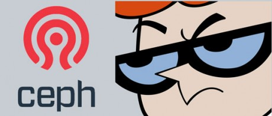

# 前言

2006年Sage Weil发表了Ceph论文，启动一个伟大的开源项目，感谢作者。

2014年Redhat及其收购的Inktank在Ceph贡献全球第一，中国的UnitedStack全球第二也是国内第一，Ubuntu麒麟也有卓越贡献，感谢开发者。

还要感谢国内外关注Ceph的开发者以及运维人员！

本书使用GitBook编写，通过`gitbook serve`运行，也可以在本地运行Docker容器：

```
docker run -d -p 4000:4000 tobegit3hub/ceph_from_scratch
```

