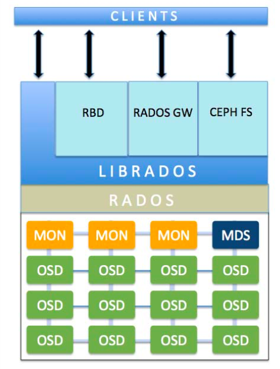

# 简介

Ceph is a distributed object, block, and file storage platform.

也就是说，使用Ceph系统我们可以提供对象存储、块设备存储和文件系统服务，更有趣的是基于Ceph的key-value存储和NoSQL存储也在开发中，让Ceph成为目前最流行的统一存储系统。

Ceph底层提供了分布式的RADOS存储，用于支撑上层的librados和RGW、RBD、CephFS等服务。Ceph实现了非常底层的object storage，是纯粹的SDS，并且支持通用的ZFS、BtrFS和Ext4文件系统，能轻易得Scale，没有单点故障。

接下来马上介绍Ceph的各个基础组件。

