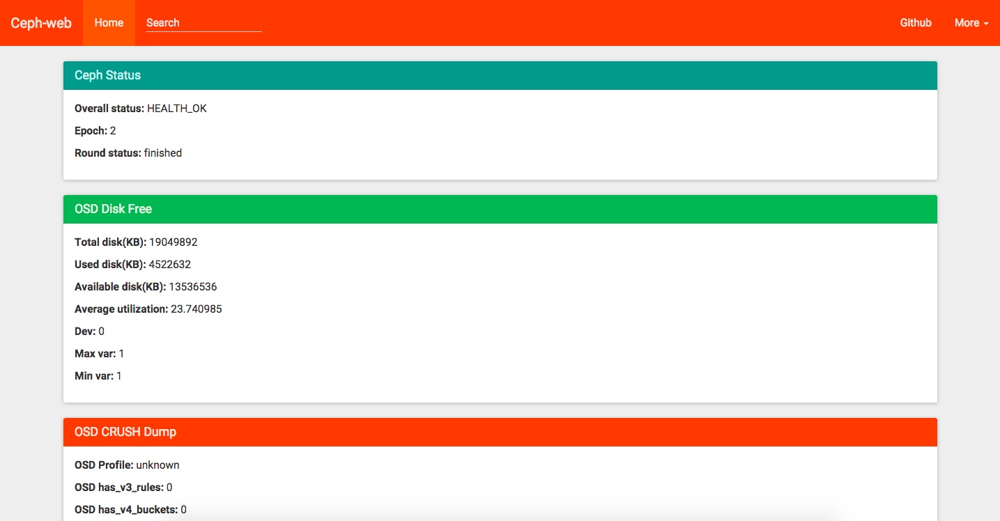

# Ceph-web

## 监控工具

前面提到过的ceph-rest-api，为我们提供了HTTP接口来访问Ceph集群的状态信息，但是只有ceph-rest-api远远不够，我们需要更友好的Web管理工具。这里我们将介绍开源的ceph-web项目，是非常简单的Web前端，通过ceph-rest-api获得数据并展示。

## Ceph-web

为了不增加API的复杂性，ceph-web遵循官方ceph-rest-api的接口，只是提供HTTP服务器并展示Ceph的数据，开源地址 https://github.com/tobegit3hub/ceph-web 。

目前ceph-web已经支持通过容器运行，执行下述命令即可一键启动Ceph监控工具。

```
docker run -d --net=host tobegit3hub/ceph-web
```

这样通过浏览器打开 http://127.0.0.1:8080 就可以看到以下管理界面。

